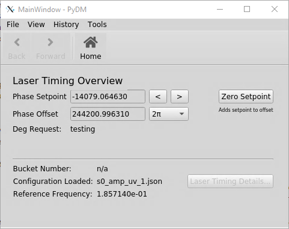
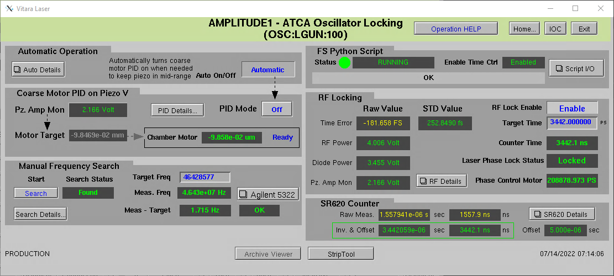
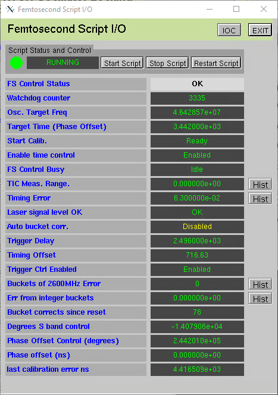
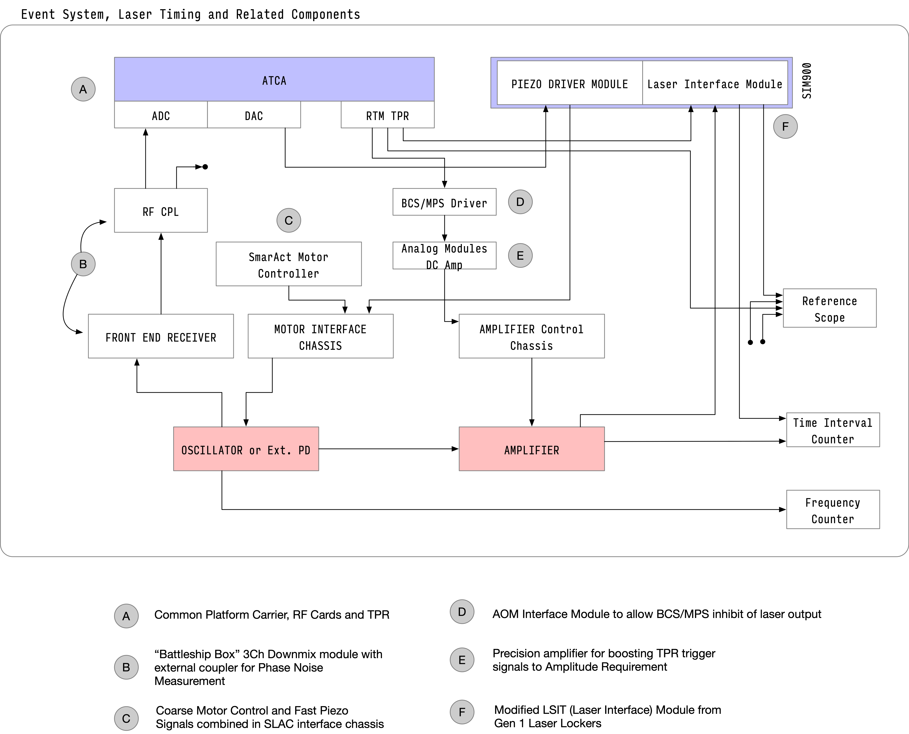

# Amplitude Systemes - Tangerine
## Laser Locker Documentation
**J. May**  
__2022/07/13__  

## Operation

The following outline presents the general operational logic of the Locker HLA:

- A core PV object maintains the connections to the PVs
- A configuration object manages the import and parsing of the configuration files, linking to the core PV object
- The main Femto.py process manages the overall run loop that has the following functions  
  - defines optimization functions  
  - initializes objects  
  - infinite loop  
    - check laser status
    - trigger calibration if requested
    - run initial calibration functions if configured
    - fix bucket jumps
    - execute requested moves
  - Infinite loop is governed by a watchdog function
    - increments watchdog counter pv
    - kills process if multiple conflicting processes
    - retires the process if a 0 is written to the counter

For the most part, the controls interfaces for the system will look familiar to those that have experience with the first generation laser lockers. In particular, the main "expert" panel and the associated script, motor control and device configuration panels change very little on the exterior.

In addition a built in user-panel that makes using the phase offset controls more straightforward is provided. Access to the low level firmware controls are available, though beyond the scope of this documentation.

#### User Panel

There are four primary controls on this panel. The left and right arrows next to Phase Setpoint will decrement or increment the phase/timing by the value in the drop down menu. The "Zero Setpoint" control will write set appropriate values such that the Phase Setpoint control will be zero-referenced at the current time.

#### Main Panel

The main user controls are contained here. Operational flow generally is left to right, top to bottom. Before the laser can be rf-locked, it needs to be mode locked and roughly centered at the cavity length corresponding to the subharmonic of the reference RF. Once centered, the RF Lock can be enabled on the right of the panel. Target time can be set directly in the field below the lock enable control.

### Triggers  

There are four triggers to note as part of this system, all provided by the TPR in slot 2 of the locker ATCA crate (backplane installed as an RTM). Triggers 0 and 1 correspond to the beam-rate and standby triggers. The laser can not currently be operated at higher than 71.5 kHz and still get reliable timing measurements.

The other channels of note are a trigger output to the reference scope temporarily installed in the controls racks in the lab, and the reference trigger for the Time Interval Counter which measures the output time of the laser. This trigger, in particular, should not be adjusted.

#### Script IO

For nearterm operation, the HLA should generally be operated with time control and trigger control enabled, but Auto Bucket Correction **Disabled**. Documentation will be revised as this situation changes.

### Hardware Connections

An installed Tangerine is represented in diagram form in figure . This diagram shows the bulk laser components and controller chassis, the laser locker hardware and related ATCA hardware, and the additional external components.

#### UV2 (Tangerine 3) Connections

In the event that the primary operational laser has an issue, and we need to switch over to the newer laser, most cabling that is needed is already installed.

## Hardware Interfaces  

There are three hardware interfaces needed for operating the Tangerine with the
the SLAC gen 1.5 ATCA-based laser locker.

### Front-End Enclosure

LLRF signal conditioning for the ATCA rf cards.

#### Design and Production Information  

[Project
Link](https://confluence.slac.stanford.edu/display/AIRTRACK/PC_379_396_25_C00)

C00 revision is compatible with chassis design: 376-246-85---97 (M. Petree)

### Motor Control Breakout

Splits out the controls for the stepper motor that controls the coarse cavity length.

#### Design and Production Information  

[Amplitude Interface Box](Amplitude_interfacebox.zip)

### Piezo Amplifier Bias Module

Provides the correct offset drive to convert the laser locker output to the
polarity of the piezo mount. 

#### Design and Production Information  

[Schematic](Piezo driver sch.pdf)

Attachments

*Provided in Amplitude Documentation*  
[Cabling Instructions](Cabling instructions.pdf)
[Piezo Specifications](piezo_15642-S01.pdf)
[Discovery Semiconductors Diode](F720-79 C DSC100 100S Datasheet.pdf)

*SLAC Components*
[Amplitude Interface Box](amplitude_interfacebox.zip)

## Software And Controls Interfaces

